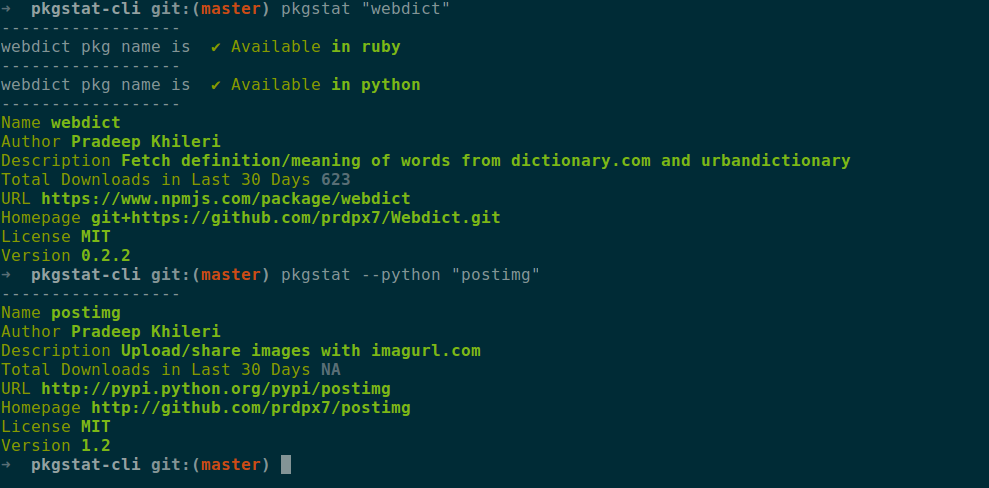

# pkgstat-cli

> search package name availability and pkg info on npm,pypi and rubygems.

[](https://travis-ci.org/prdpx7/pkgstat-cli) 
[](https://raw.githubusercontent.com/prdpx7/pkgstat-cli/master/LICENSE)

## Install
```
$ npm install -g pkgstat-cli
```
## Usage
```
$ pkgstat --help
Usage: pkgstat [options]

  Options:

    -h, --help           output usage information
    -V, --version        output the version number
    -s , --search <pkg>  search for pkg name availability in npm,pip and gems
    --node <pkg_name>    info on node pkg from npm
    --python <pkg_name>  info on python pkg from pypi
    --ruby <pkg_name>    info on ruby pkg from rubygems
```
## Demo

